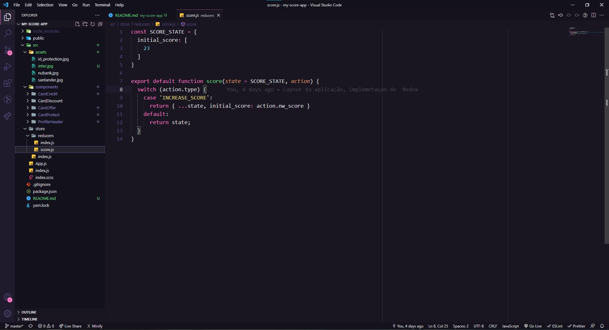
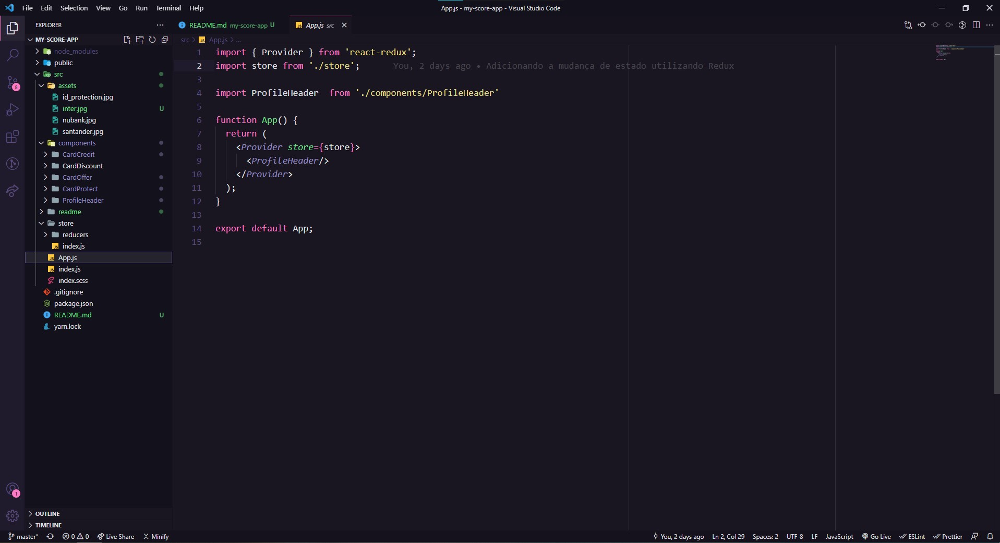
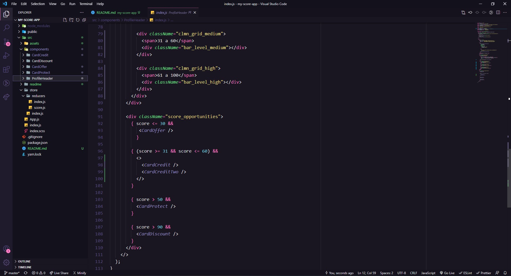
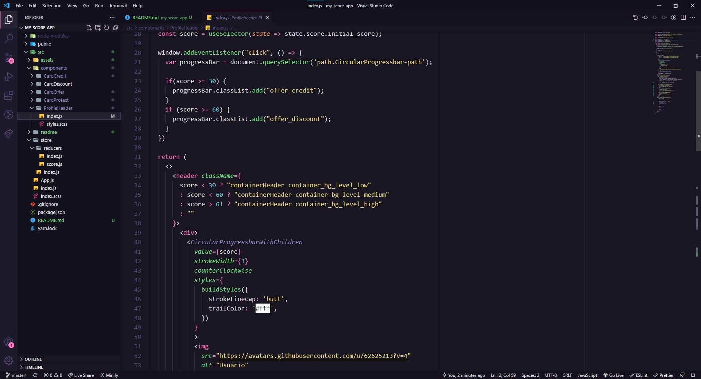

**Desafio proposto**

Estamos muito felizes em saber que você chegou até aqui. Realize o teste com calma, essa é a oportunidade de demonstrar suas habilidades e conhecimentos!

É hora de codar!

Imagine que...

Você trabalha em uma plataforma com taxa de acesso por smartphone em +80%. Todos os usuários do seu sistema possuem uma pontuação de 0 - 100, ela influencia diretamente na jornada de cada um. Portanto, sua tela e elementos apresentados terão cores e ordenação de acordo com este valor.

O range de pontuação é definido com base na situação financeira do usuário, são elas:

- Caso a pontuação esteja abaixo de 30, ele recebe ofertas para negociar suas dívidas;
- Caso sua pontuação esteja entre 31 e 60, ele está elegível para solicitar crédito, podendo escolher uma das proposta oferecidas;
- Caso sua pontuação esteja acima de 50, será apresentado para ele um card com um plano de proteção ao RG;
- Caso sua pontuação esteja acima de 90, ele receberá um desconto (%) para obter o seu programa de proteção ao RG.

**Instruções:**
Para buscar as informações dos cards é necessário enviar a pontuação do usuário;
Cada vez que o usuário fechar uma dívida/aceitar uma proposta/adquirir o plano de proteção, você deverá alterar a pontuação do usuário. Fazendo com que cards apresentados sigam as regras de pontuação;
Crie uma estrutura que forneça os dados para a sua aplicação.
Tecnologias:
Utilize React ou Angular no desenvolvimento. Caso não sinta confortável com as opções, desenvolva com outra da sua preferência! :D

Você ganhará pontos extras, se:
- Utilizar um pré-processador (SASS, Stylus, LESS, ...);
- Utilizar redux-saga;
- Escrever teste unitário (Lib/Framework da sua preferência);
- Documentar a solução;
- Desenvolver um código limpo e bem organizado.

---------------------------------------------------------------------------------------------------------------------------------------------------------------------------------

**Resolução:** Primeiro utilizei o redux para centralizar o estado da aplicação. Distribuindo por meio do *Provider* essa informação para toda a aplicação.

- Escolhi utilizar [Redux + Hooks](https://react-redux.js.org/introduction/getting-started#hooks) para consumir o estado e dar dispatch na action que irá **alterar a pontuação do usuário cada vez que o usuário fechar uma dívida/aceitar uma proposta/adquirir o plano de proteção** com uma lógica para gerar um número aleatório inteiro entre o **initial_score (23) até a pontuação máxima.**

- Criei components para cada tipo de card que seria exibido conforme a pontuação do usuário e com a [renderização condicional](https://reactjs.org/docs/conditional-rendering.html#gatsby-focus-wrapper) criei regras para exibí-los conforme necessário. 

- Para criar e modificar os componentes e visuais da página também utilizei a renderização condicional, no entanto, para a barra de progresso ao redor da foto optei por utilizar uma dependência que cria um [component](https://www.npmjs.com/package/react-circular-progressbar) para isso. Pra modificar as cores da barra, utilizei um addListener para alterar a classe do elemento ao evento de click, criando uma condicional de acordo com as regras de pontuação.

🚀 **Como rodar o projeto**

- Instale as dependencias com `yarn`
- Rode o front-end com `yarn start`
