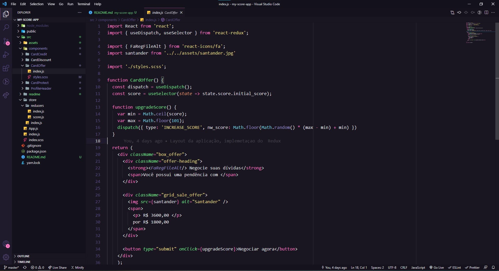

**Resolução:** Primeiro utilizei o redux para centralizar o estado da aplicação. Distribuindo por meio do *Provider* essa informação para toda a aplicação.

- Escolhi utilizar [Redux + Hooks](https://react-redux.js.org/introduction/getting-started#hooks) para consumir o estado e dar dispatch na action que irá **alterar a pontuação do usuário cada vez que o usuário fechar uma dívida/aceitar uma proposta/adquirir o plano de proteção** com uma lógica para gerar um número aleatório inteiro entre o **initial_score (23) até a pontuação máxima.**

- Criei components para cada tipo de card que seria exibido conforme a pontuação do usuário e com a [renderização condicional](https://reactjs.org/docs/conditional-rendering.html#gatsby-focus-wrapper) criei regras para exibí-los conforme necessário. 

- Para criar e modificar os componentes e visuais da página também utilizei a renderização condicional, no entanto, a barra de progresso ao redor da foto optei por utilizar uma dependência que cria um [component](https://www.npmjs.com/package/react-circular-progressbar) para isso. Pra modificar as cores da barra, utilizei um addListener para alterar a classe do elemento ao evento de click, criando uma condicional de acordo com as regras de pontuação.

